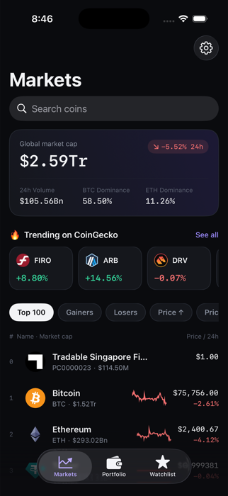
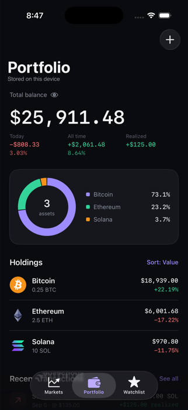
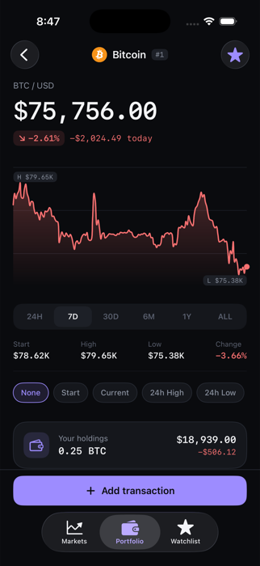

# Crypter

A cryptocurrency market tracker and portfolio ledger for iOS, built with SwiftUI.

Crypter shows live prices from CoinGecko, lets you follow coins on a watchlist, and
tracks what you own as a ledger of buys and sells — so your holdings, average cost
and profit are derived from real transactions rather than a number you typed once.

Everything stays on your device. There is no account, no server, and nothing is
uploaded.

| Markets | Portfolio | Coin detail |
| --- | --- | --- |
|  |  |  |

## Features

**Markets**
- Live prices for the top coins, with 7-day sparklines and 24h change
- Search across every listed coin, not just the page on screen
- Sort by rank, price, or the day's biggest gainers and losers
- Global market cap, 24h volume and BTC/ETH dominance
- Trending coins from CoinGecko's search rankings

**Portfolio**
- Holdings derived from buy and sell transactions using average-cost accounting
- Today's change, all-time profit, and profit already realized by selling
- Allocation donut with a per-coin breakdown
- Value charted over time, sampled daily
- Full transaction history, editable, with CSV import and export
- Hide balances with one tap, or lock the tab behind Face ID

**Watchlist**
- Follow coins from a coin's page or by long-pressing a row in Markets
- Reorder by dragging, remove by swiping

**Coin detail**
- Interactive price chart across 24h to all-time ranges, with scrubbing
- Market statistics, 24h range, and the project's description and links
- Your position in that coin, its transactions, and its average cost

**Settings**
- Optional CoinGecko API key, stored in the Keychain, to lift the public rate limit
- Seven display currencies, applied to both the prices requested and how they are shown
- Import and export transactions as CSV
- Delete all portfolio data

**Home screen widget**
- Small and medium sizes, showing the largest coins and their daily change

## Requirements

- iOS 17.6 or later
- Xcode 26 or later
- Swift 5

No package manager or dependencies — the project builds with Apple frameworks only
(SwiftUI, Combine, Core Data, Swift Charts).

## Getting started

```bash
git clone git@github.com:bishalw/Crypter.git
cd Crypter
open Crypter.xcodeproj
```

Select a simulator and run. Prices load straight away; the public CoinGecko API
needs no key.

### Using your own API key (optional)

The public tier is rate limited, and a busy session can hit it — the app says so
when that happens. A free key from the
[CoinGecko dashboard](https://www.coingecko.com/en/developers/dashboard) raises the
limit.

Open **Markets → gear icon → Data source**, choose Demo or Pro, and paste the key.
It is stored in the device Keychain and sent only to CoinGecko.

## Architecture

Layered MVVM with Combine, split so the UI never talks to the network or the
database directly.

```
Crypter/
├── Data/
│   ├── Local/          Core Data store, Keychain, file cache for coin images
│   ├── Models/         API DTOs and their mappers to domain models
│   ├── Remote/         URLSession networking and the CoinGecko endpoints
│   └── Repository/     Repository implementations
├── Domain/
│   ├── Repository Protocol/   Repository interfaces the data layer implements
│   └── Store/                 CryptoStore (market data), WatchlistStore
└── Presentation/
    ├── Extensions/     Colour theme, formatters, view helpers
    ├── HelperViews/    Reusable controls
    └── Screens/        Markets, Portfolio, Watchlist, Detail, Settings

CrypterWidget/         Home screen widget, a separate extension target
```

**Data flow.** A repository fetches and decodes, a store publishes the result as a
Combine subject, a view model maps it into display state, and the view renders it.
Dependencies are wired once in `Core` and injected as an environment object.

**Holdings are derived, never stored.** `PortfolioDataServiceImpl` keeps a table of
transactions; quantity, average cost and profit are recomputed from them whenever
they change. A stored balance could drift from its own history, so there isn't one.
Selling uses average-cost accounting: buys raise the basis, sells reduce the
quantity at the running average, and what a sell earned is recorded as realized
profit.

**Holdings with no cost basis.** Positions carried over from before transaction
tracking exist as "opening balance" entries with a quantity but no price. They are
excluded from profit figures rather than counted as free gains, and you can give
them a cost at any time.

## Testing

```bash
xcodebuild test -project Crypter.xcodeproj -scheme Crypter \
  -destination 'platform=iOS Simulator,name=iPhone 17 Pro'
```

The suite concentrates on the money arithmetic: averaging across buys, sells
against a running average, overselling, opening balances, date ordering, and the
consistency check that rejects an edit which would make an earlier history
impossible.

## Data source

Market data comes from the [CoinGecko API](https://www.coingecko.com/en/api).
Crypter is not affiliated with CoinGecko.

## Disclaimer

Crypter is for tracking and information only. It is not investment advice, and the
figures it shows depend on data you enter and on a third-party API. Do not rely on
it for tax reporting or trading decisions.
